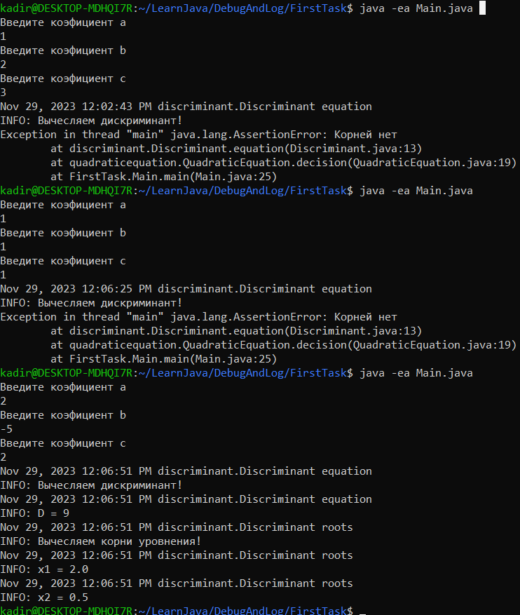

# Отладка и логирование в Java


Для работы с assert и логами, я взял прошлую задачу с дискриминантом. При вычисления корней уровнения, находим дискриминант и вычесляем корни,
 и если значение дискриминант меньше нуля, мы не можем найти корни, поэтому при вычеслении дискриминанта поставил assert,
 и если D меньше нуля, выйдет исключение AssertionError   
```java 
assert D>-1:"Корней нет";
```

Логи я ипользовал для просмотра включения функций, и просмотра какие они значения они выводят
```java
logger.info("Вычесляем дискриминант!");
logger.info("D = " + D);
```
----

### Компиляция нашей программы
```shell
javac -d . Main.java
```
------------------
### Запуск программы
```shell 
java -ea Main.java
```
-------------------

### Вывод нашей программы

