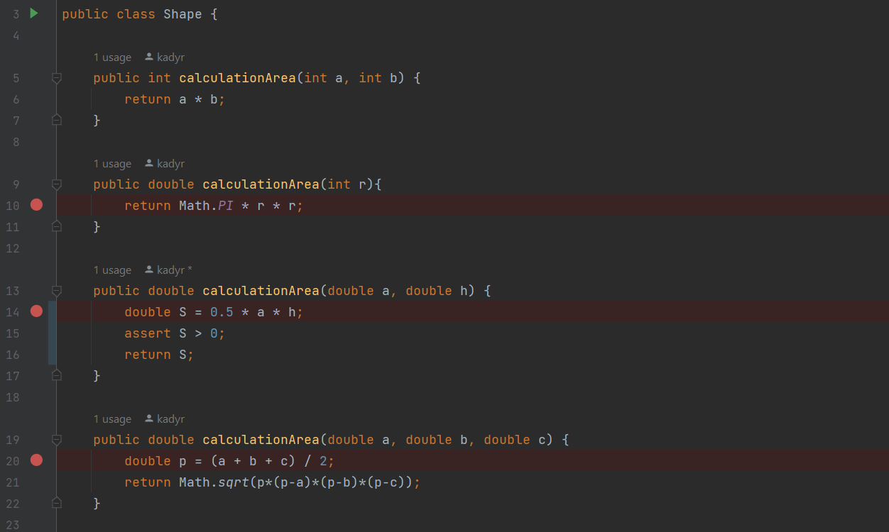
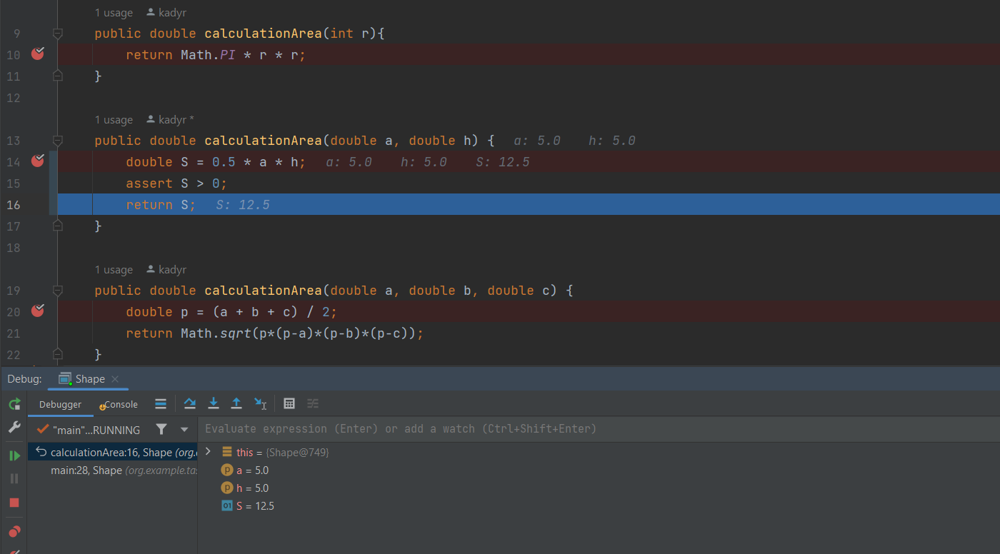
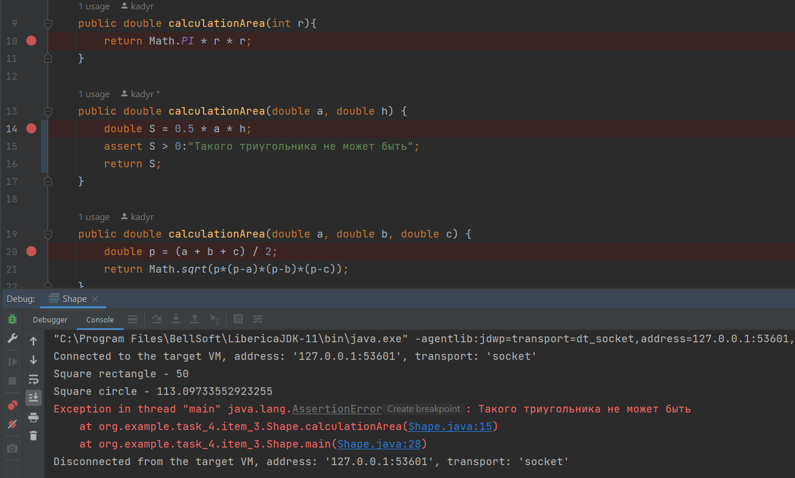

# Отладка в intellij IDEA
Для отладки я взял класс Shape, где есть несколько перегруженных методов для расчета площади фигур.  

### Процесс отладки
Я поставил точки прерывания в нескольких местах.

Перешел из одной точки в другую.

Между точками прерывания выскочило исключение, потому что у триугольника площадь неможет быть нулевым.   

