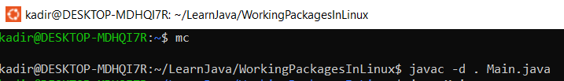
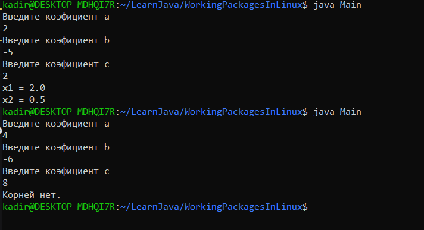

# Работа с пакетами в Linux


Для решения этой задачи, я установил wsl, и поставил ubuntu. Для удобства работы с каталогами поставил midnight commander. 
И для решения я взял прошлую задачу решения квадратного уровнения с помощью дискриминанта.У меня в программе есть есть три класса Discriminant,
QuadraticEquation и Main. В первом классе есть статические методы дискриминанта, и вычеслиние корней квадратного уровнения. Во втором классе есть поля 
коэфициенты квадратного уровнения, и решение уровнения с  помощью статических методов класса Discriminant.
Третий класс точка входа нашего приложения, и в этом классе мы вводим в консоль значения коэфициентов и считаем 
корни уровнения с помощью метода decision класса QuadraticEquation.  

----

### Компиляция нашей программы
```shell
javac -d . Main.java
```

------------------
### Запуск программы
```shell 
java Main.java
```
-------------------

### Вывод нашей программы

